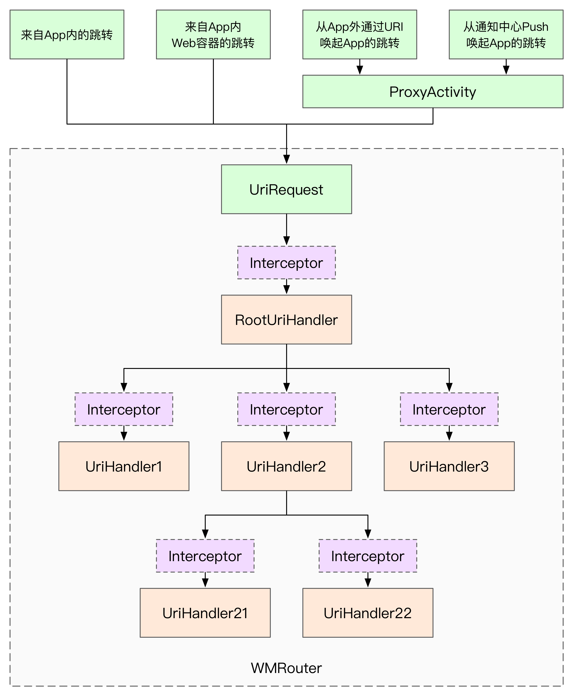
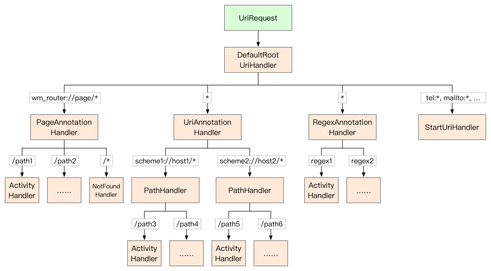

# WMRouter

[TOC]

WMRouter是一款Android路由框架，基于组件化的设计思路，有功能灵活强大、使用简单的特点。

## 功能简介

WMRouter主要提供URI分发、ServiceLoader两大功能。

URI分发功能可用于多工程之间的页面跳转、动态下发URI链接的跳转等场景，特点如下：

1. 支持多Scheme、Host、Path
2. 支持URI正则匹配
3. 页面配置支持Java代码动态注册，或注解配置自动注册
4. 支持配置全局和局部拦截器，可在跳转前执行同步/异步操作，例如定位、登录等
5. 支持单次跳转特殊操作：Intent设置Extra/Flags、设置跳转动画、自定义StartActivity操作等
6. 支持页面Exported控制，特定页面不允许外部跳转
7. 支持配置全局和局部降级策略
8. 支持配置单次和全局跳转监听
9. 完全组件化设计，核心组件均可扩展、按需组合，实现灵活强大的功能


基于[SPI (Service Provider Interfaces) ](https://docs.oracle.com/javase/tutorial/sound/SPI-intro.html)的设计思想，WMRouter提供了ServiceLoader模块，类似Java中的`java.util.ServiceLoader`，但功能更加完善。通过ServiceLoader可以在一个App的多个模块之间通过接口调用代码，实现模块解耦，便于实现组件化、模块间通信，以及和依赖注入类似的功能等。其特点如下：

1. 使用注解自动配置
2. 支持获取接口的所有实现，或根据Key获取特定实现
3. 支持获取Class或获取实例
4. 支持无参构造、Context构造，或自定义Factory、Provider构造
5. 支持单例管理
6. 支持方法调用


其他特性：

1. 优化的Gradle插件，对编译耗时影响很小
2. 编译期和运行时配置检查，避免配置冲突和错误
3. 编译期自动添加Proguard混淆规则，免去手动配置的繁琐
4. 完善的调试功能，帮助及时发现问题


## 适用场景

WMRouter适用但不限于以下场景：

1. Native+H5混合开发模式，需要进行页面之间的互相跳转，或进行灵活的运营跳转链接下发。可以利用WMRouter统一页面跳转逻辑，根据不同的协议（HTTP、HTTPS、用于Native页面的自定义协议）跳转对应页面，且在跳转过程中可以使用UriInterceptor对跳转链接进行修改，例如跳转H5页面时在URL中加参数。

2. 页面跳转有复杂判断逻辑的场景。例如多个页面都需要先登录、先定位后才允许打开，如果使用常规方案，这些页面都需要处理相同的业务逻辑；而利用WMRouter，只需要开发好UriInterceptor并配置到各个页面即可。

3. 多工程、组件化、平台化开发。多工程开发要求各个工程之间能互相通信，也可能遇到和外卖App类似的代码复用、依赖注入、编译等问题，这些问题都可以利用WMRouter的URI分发和ServiceLoader模块解决。

4. 对业务埋点监控需求较强的场景。页面跳转作为最常见的业务逻辑之一，可对其进行埋点监控。给每个页面配置好URI，使用WMRouter统一进行页面跳转，并在全局的OnCompleteListener中进行埋点监控即可。

5. 页面A/B测试、页面降级、动态配置等场景。在WMRouter提供的接口基础上进行少量开发配置，就可以实现这样一些效果：根据下发的A/B测试策略跳转不同的页面实现；页面跳转时进行判断（例如请求接口），在出现异常情况时自动降级，打开降级后的页面；根据不同的需要动态下发一组路由表，相同的URI跳转到不同的一组页面（实现方面可以自定义UriInterceptor，对匹配的URI返回301的UriResult使跳转重定向）。


## URI跳转核心设计思路与接口

下图展示了WMRouter中URI跳转的核心设计思路。借鉴网络请求的机制，WMRouter中的每次URI跳转视为发起一个UriRequest；URI跳转请求被WMRouter逐层分发给一系列的UriHandler进行处理；每个UriHandler处理之前可以被UriInterceptor拦截，并插入一些特殊操作。




### UriRequest

UriRequest中包含Context、URI和Fields，其中Fields为HashMap<String, Object>，可以通过Key存放任意数据。简单起见，UriRequest类同时承担了Response的功能，跳转请求的结果，也会被保存到Fields中。
存放到Fields中的常见字段举例如下，也可以根据需要自定义，**为了避免冲突，建议字段名用完整的包名开头**。

- Intent的Extra参数，Bundle类型
- 用于startActivityForResult的RequestCode，int类型
- 用于overridePendingTransition方法的页面切换动画资源，int[]类型
- 本次跳转结果的监听器，OnCompleteListener类型


每次URI跳转请求会有一个ResultCode（类似HTTP请求的ResponseCode），表示跳转结果，也存放在Fields中。常见Code如下，用户也可以自定义Code，**为了避免冲突，自定义Code应使用负数值**。

- 200：跳转成功
- 301：重定向到其他URI，会再次跳转
- 400：请求错误，通常是Context或URI为空
- 403：禁止跳转，例如跳转白名单以外的HTTP链接、Activity的exported为false等
- 404：找不到目标(Activity或UriHandler)
- 500：发生错误

总结来说，UriRequest用于实现一次Uri跳转中所有组件之间的通信功能。


### UriHandler

UriHandler用于处理URI跳转请求，可以嵌套从而逐层分发和处理请求。UriHandler是异步结构，接收到UriRequest后处理（例如跳转Activity等），如果处理完成，则调用`callback.onComplete()`并传入ResultCode；如果没有处理，则调用`callback.onNext()`继续分发。

下面的示例代码展示了一个只处理HTTP链接的UriHandler的实现。

```java
public interface UriCallback {

    /**
     * 处理完成，继续后续流程。
     */
    void onNext();

    /**
     * 处理完成，终止分发流程。
     *
     * @param resultCode 结果
     */
    void onComplete(int resultCode);
}

public class DemoUriHandler extends UriHandler {
    public void handle(@NonNull final UriRequest request, @NonNull final UriCallback callback) {
        Uri uri = request.getUri();
        // 处理HTTP链接
        if ("http".equalsIgnoreCase(uri.getScheme())) {
            try {
            	// 调用系统浏览器
                Intent intent = new Intent();
                intent.setAction(Intent.ACTION_VIEW);
                intent.setData(uri);
                request.getContext().startActivity(intent);
            	// 跳转成功
                callback.onComplete(UriResult.CODE_SUCCESS);
            } catch (Exception e) {
            	// 跳转失败
            	callback.onComplete(UriResult.CODE_ERROR);
            }
        } else {
        	// 非HTTP链接不处理，继续分发
            callback.onNext();
        }
    }
    // ...
}
```


### UriInterceptor

UriInterceptor为拦截器，不做最终的URI跳转操作，但可以在最终的跳转前进行各种同步/异步操作，常见操作举例如下：

- URI跳转拦截，禁止特定的URI跳转，直接返回403（例如禁止跳转非meituan域名的HTTP链接）
- URI参数修改（例如在HTTP链接末尾添加query参数）
- 各种中间处理（例如打开登录页登录、获取定位、发网络请求）
- ……

每个UriHandler都可以添加若干UriInterceptor。在UriHandler基类中，handle()方法先调用抽象方法`shouldHandle()`判断是否要处理UriRequest，如果需要处理，则逐个执行Interceptor，最后再调用`handleInternal()`方法进行跳转操作。

举例来说，跳转某些页面需要先登录，可以实现一个LoginInterceptor如下。

```java
public class LoginInterceptor implements UriInterceptor {

    @Override
    public void intercept(@NonNull UriRequest request, @NonNull final UriCallback callback) {
        final FakeAccountService accountService = FakeAccountService.getInstance();
        if (accountService.isLogin()) {
        	// 已经登录，不需处理，继续跳转流程
            callback.onNext();
        } else {
        	// 没登录，提示登录并启动登录页
            Toast.makeText(request.getContext(), "请先登录~", Toast.LENGTH_SHORT).show();
            accountService.registerObserver(new FakeAccountService.Observer() {
                @Override
                public void onLoginSuccess() {
                    accountService.unregisterObserver(this);
                    // 登录成功，继续跳转
                    callback.onNext();
                }

                @Override
                public void onLoginFailure() {
                    accountService.unregisterObserver(this);
                    // 登录失败，终止流程，返回错误ResultCode
                    callback.onComplete(CustomUriResult.CODE_LOGIN_FAILURE);
                }
            });
            // 启动登录页
            startActivity(request.getContext(), LoginActivity.class);
        }
    }
}
```


### 灵活性与易用性的平衡

由于WMRouter是一个开放式组件化框架，UriRequest可以存放任意数据，UriHandler、UriInterceptor可以完全自定义，不同的UriHandler可以任意组合，具有很大的灵活性。但过于灵活容易导致易用性的下降，即使对于最常规最简单的应用，也需要复杂的配置才能完成功能。

为了在两者之间平衡，WMRouter对包结构进行了划分，核心接口和实现类提供基础通用能力，尽可能保留最大的灵活性。可以在core包基础上进行自定义开发和配置，独立运行。

- core：提供核心接口和实现类，提供基础通用能力。
- utils：通用工具类。
- components：辅助功能组件。

在保证核心组件灵活性的基础上，WMRouter又封装了一系列通用实现类，并组合成一套默认实现，满足绝大多数使用场景。

- activity：Activity跳转相关。
- regex：正则匹配相关。
- common：UriHandler、UriInterceptor、UriRequest通用实现类。

WMRouter还提供了ServiceLoader模块。

- service：ServiceLoader模块。
- method：方法调用，提供了几个通用接口，基于ServiceLoader实现方法调用。


## 接入

### Gradle配置

1. 在所有Android工程中（包括Application和Library工程）配置如下（1.0.x为版本号）。

    ```groovy
    repositories {
        maven { url "https://dl.bintray.com/meituanwaimai-android/maven" }
    }
	dependencies {
    	// 在基础库中依赖router即可
    	compile 'com.sankuai.waimai.router:router:1.0.x'
        // 使用了注解的Library都需要配置
        annotationProcessor 'com.sankuai.waimai.router:compiler:1.0.x'
    }
    ```

2. 在Application工程中，配置Gradle插件。

	根目录的`build.gradle`：

    ```groovy
    buildscript {
        repositories {
            maven { url "https://dl.bintray.com/meituanwaimai-android/maven" }
        }
    	dependencies {
        	classpath 'com.android.tools.build:gradle:2.3.3'
            // 添加WMRouter插件
	        classpath "com.sankuai.waimai.router:plugin:1.0.x"
        }
    }
    ```

	Application模块中的`build.gradle`：

    ```groovy
    apply plugin: 'com.android.application'
    // 应用WMRouter插件
    apply plugin: 'WMRouter'
    ```


### 初始化

在`Application.onCreate`中初始化：

```java
// 创建RootHandler
DefaultRootUriHandler rootHandler = new DefaultRootUriHandler(context);

// 初始化
Router.init(rootHandler);
```


### Manifest与外部跳转配置

跳转的目标Activity不需要配置IntentFilter，也不需要配置exported。

```xml
<activity name = ".AccountActivity" />
```

所有的外部URI跳转建议由一个中转Activity接收，再调用Router跳转到目标页面。由于跳转过程中可能会触发定位、登录等各种异步逻辑，因此中转Activity应该有界面，并监听在跳转结束后关闭Activity。

```xml
<activity android:name=".UriProxyActivity" android:exported="true">
    <intent-filter>
    	<!-- 接收所有scheme为demo的外部URI跳转，不区分host和path -->
        <data android:scheme="demo"/>
    </intent-filter>
</activity>
```

```java
public class UriProxyActivity extends BaseActivity {

    @Override
    protected void onCreate(@Nullable Bundle savedInstanceState) {
        super.onCreate(savedInstanceState);
        DefaultUriRequest.startFromProxyActivity(this, new OnCompleteListener() {
            @Override
            public void onSuccess(@NonNull UriRequest request) {
                finish();
            }

            @Override
            public void onError(@NonNull UriRequest request, int resultCode) {
                finish();
            }
        });
    }
}
```


### 其他可选配置

请参考后文“高级配置”中的说明。


## 发起URI跳转

启动一个URI。

```java
// 直接传context和URI
Router.startUri(context, "/account");

// 或构造一个UriRequest
Router.startUri(new UriRequest(context, "/account"))
```

使用UriRequest的默认封装子类DefaultUriRequest，以Builder形式给本次跳转设置各种参数。

```java
new DefaultUriRequest(context, "/account")
		// startActivityForResult使用的RequestCode
        .activityRequestCode(100)
        // 设置跳转来源，默认为内部跳转，还可以是来自WebView、来自Push通知等。
        // 目标Activity可通过UriSourceTools区分跳转来源。
        .from(UriSourceTools.FROM_INTERNAL)
        // Intent加参数
        .putIntentExtra("test-int", 1)
        .putIntentExtra("test-string", "str")
        // 设置Activity跳转动画
        .overridePendingTransition(R.anim.enter_activity, R.anim.exit_activity)
        // 监听跳转完成事件
        .onComplete(new OnCompleteListener() {
            @Override
            public void onSuccess(@NonNull UriRequest request) {
                ToastUtils.showToast(request.getContext(), "跳转成功");
            }

            @Override
            public void onError(@NonNull UriRequest request, int resultCode) {

            }
        })
        // 这里的start实际也是调用了Router.startUri方法
        .start();
```


## URI分发流程与配置

### 概述

DefaultRootUriHandler在接收到UriRequest后，会依次尝试分发给PageAnnotationHandler、UriAnnotationHandler、RegexAnnotationHandler、StartUriHandler，如图所示。

1. PageAnnotationHandler处理所有`wm_router://page/*`形式的URI跳转，根据path匹配由`RouterPage`注解配置的节点。

2. UriAnnotationHandler根据URI的Scheme+Host，分发到对应的PathHandler（如果有），之后PathHandler再根据path匹配`RouterUri`注解配置的节点。

3. RegexAnnotationHandler根据优先级和正则匹配尝试将URI分发给`RouterRegex`配置的每个节点。

4. StartUriHandler尝试直接使用Android原生的隐式跳转启动URI，用于处理其他类型的URI，例如`tel:*`、`mailto:*`。




### RouterUri注解

RouterUri注解可用于Activity或UriHandler的非抽象子类。Activity也会被转化成UriHandler，在Activity中可以通过`Intent.getData()`获取到URI。

参数如下：

- path：跳转URI要用的path，必填。path应该以"/"开头，支持配置多个path。
- scheme、host：跳转URI的Scheme和Host，可选。
- exported：是否允许外部跳转，可选，默认为false。
- interceptors：要添加的Interceptor，可选，支持配置多个。


#### 举例

1、用户账户页面跳转前要先登录，添加了一个LoginInterceptor。

```java
@RouterUri(path = "/account", interceptors = LoginInterceptor.class)
public class UserAccountActivity extends Activity {

}
```

2、一个页面配置多个path。

```java
@RouterUri(path = {"/path1"， "/path2"})
public class TestActivity extends Activity {

}
```

3、根据后台下发的ABTest策略，同一个链接跳转不同的Activity。其中AbsActivityHandler是WMRouter提供的用于跳转Activity的UriHandler通用基类。

```java
@RouterUri(path = DemoConstant.HOME_AB_TEST)
public class HomeABTestHandler extends AbsActivityHandler {

    @NonNull
    @Override
    protected Intent createIntent(@NonNull UriRequest request) {
        if (FakeABTestService.getHomeABStrategy().equals("A")) {
            return new Intent(request.getContext(), HomeActivityA.class);
        } else {
            return new Intent(request.getContext(), HomeActivityB.class);
        }
    }
}
```


### RouterRegex注解

RouterRegex注解也可以用于Activity和UriHandler，通过正则进行URI匹配。

参数如下：

- regex：正则表达式，必填。用于匹配完整的URI字符串。
- priority：优先级，数字越大越先匹配，可选，默认为0。优先级相同时，不保证先后顺序。
- exported：是否允许外部跳转，可选，默认为false。
- interceptors：要添加的Interceptor，可选，支持配置多个。


#### 举例

1、对于指定域名的http(s)链接，使用特定的WebViewActivity打开。

```java
@RouterRegex(regex = "http(s)?://(.*\\.)?(meituan|sankuai|dianping)\\.(com|info|cn).*", priority = 2)
public class WebViewActivity extends BaseActivity {

}
```

2、对于其他http(s)链接，使用系统浏览器打开。

```java
@RouterRegex(regex = "http(s)?://.*", priority = 1)
public class SystemBrowserHandler extends UriHandler {

    @Override
    protected boolean shouldHandle(@NonNull UriRequest request) {
        return true;
    }

    @Override
    protected void handleInternal(@NonNull UriRequest request, @NonNull UriCallback callback) {
        try {
            Intent intent = new Intent();
            intent.setAction(Intent.ACTION_VIEW);
            intent.setData(request.getUri());
            request.getContext().startActivity(intent);
            callback.onComplete(UriResult.CODE_SUCCESS);
        } catch (Exception e) {
            callback.onComplete(UriResult.CODE_ERROR);
        }
    }
}
```


### RouterPage注解

实际项目开发过程中，URI跳转常有两种需求：一种是运营后台配置和下发链接让客户端跳转，跳转协议需要和各端保持一致；另一种是App拆分多个工程，需要在工程之间跳转页面，使用路由组件代替显式跳转，实现解耦。

由于种种历史原因，这两套URI可能会出现不兼容的问题，因此需要对两套URI分别做实现。RouterPage注解就是用于实现内部页面跳转而设计的。

RouterPage注解用于指定内部页面跳转，和RouterUri注解相比，RouterPage注解对应的scheme和host为固定的`wm_router://page`，不可配置，exported为false也不可配置。

参数如下：

- path：跳转URI要用的path，必填。path应该以"/"开头，支持配置多个path。
- interceptors：要添加的Interceptor，可选，支持配置多个。


#### 举例

```java
// demo://demo/account
@RouterUri(path = "/account", scheme = "demo", host = "demo")
// wm_router://page/account
@RouterPage(path = "/account")
public class AccountActivity {
    @Override
    protected void onCreate(@Nullable Bundle savedInstanceState) {
        super.onCreate(savedInstanceState);
        if (PageAnnotationHandler.isPageJump(getIntent())) {
        	// ...
        } else {
        	// ...
        }
    }
}
```

```java
Router.startUri(context, PageAnnotationHandler.SCHEME_HOST + "/account");
```


## ServiceLoader模块的使用

ServiceLoader模块使用主要分三步：

1. 定义Java接口
2. 注解声明实现类
3. 加载实现类

### 1、RouterService注解声明实现类

通过RouterService注解声明实现类所实现的接口（**或继承的父类，例如Activity、Fragment、Object等，后文不再重复说明**），一个接口可以有多个实现类，一个类也可以同时实现多个接口。RouterService注解的参数如下：

- interfaces：必选参数。声明实现的接口，可配置多个。
- key：可选参数。同一接口的不同实现类，通过唯一的key进行区分。
- singleton：可选参数。声明实现类是否为单例，默认为false。

示例如下：

```java
public interface IService {

}

@RouterService(interfaces = IService.class, key = 'key1')
public static class ServiceImpl1 implements IService {

}

@RouterService(interfaces = IService.class, key = 'key2', singleton = true)
public static class ServiceImpl2 implements IService {

}
```


### 2、获取实现类的Class

可以直接获取实现类的Class，例如获取Activity的Class进行页面跳转。

#### 2.1 指定接口和Key，获取某个实现类的Class（要求注解声明时指定了Key）

```java
Class<IService> clazz = Router.getServiceClass(IService.class, "key1");
```

#### 2.2 指定接口，获取注解声明的所有实现类的Class

```java
List<Class<IService>> classes = Router.getAllServiceClasses(IService.class);
```


### 3、获取实现类的实例

ServiceLoader更常见的使用场景，是获取实现类的实例而不是Class。实现类的构造在ServiceLoader中最终由Factory实现，构造失败会返回null或空数组。

#### 3.1 无参数构造

```java
// 使用无参构造函数
IService service = Router.getService(IService.class, "key1");
List<IService> list = Router.getAllServices(IService.class);
```

#### 3.2 Context参数构造

```java
// 使用Context参数构造
IService service = Router.getService(IService.class, context);
List<IService> list = Router.getAllServices(IService.class, context);
```

#### 3.3 自定义Factory通过反射构造

对于实现类有特殊构造函数的情况，可以通过Factory自行从class获取构造方法进行构造，示例如下：

```java
// 使用自定义Factory
IFactory factory = new IFactory() {
	public Object create(Class clazz) {
    	return clazz.getConstructor().newInstance();
    }
};
IService service = Router.getService(IService.class, factory);
List<IService> list = Router.getAllServices(IService.class, factory);
```

#### 3.4 使用Provider提供实例

在声明实现类时，可以在类中定义一个返回值类型为该实现类且无参数的静态方法，并使用RouterProvider注解标注。当调用Router获取实例时，如果没有指定Factory，则优先调用Provider方法获取实例，找不到Provider再使用无参数构造。使用示例如下：

```java

@RouterService(interfaces = IService.class, key = 'key', singleton = true)
public static class ServiceImpl implements IService {

	public static final ServiceImpl INSTANCE = new ServiceImpl();

	// 使用注解声明该方法是一个Provider
	@RouterProvider
	public static ServiceImpl provideInstance() {
    	return INSTANCE;
    }
}

// 调用时不传Factory，优先找Provider，找不到再使用无参数构造
IService service = Router.getService(IService.class, "key");
List<IService> list = Router.getAllServices(IService.class);
```

#### 3.5 singleton参数说明

注解声明为singleton的单例实现类，在调用`getService()/getAllServices()`方式获取实例时，实例会由单例缓存池管理，WMRouter中不会重复构造，且线程安全。

** 注意：当通过ServiceLoader获取Class、直接调用等其他方式使用实现类时，应避免重复创建对象，否则会导致单例失效。可以结合Provider确保实例不会重复创建。**


### 4、方法调用

利用ServiceLoader可以实现方法调用。

WMRouter的method包中提供了通用的Function接口Func0 ~ Func9、FuncN，分别表示参数为0~9或可变参数的方法。声明方法时应该实现Function接口，示例如下。对于调用次数较多的方法，建议声明为singleton，避免每次调用时重复创建。

```java
@RouterService(interfaces = Func2.class, key = "/add", singleton = true)
public class AddMethod implements Func2<Integer, Integer, Integer> {
    @Override
    public Integer call(Integer a, Integer b) {
        return a + b;
    }
}
```

方法的调用示例如下：

```java
Func2<Integer, Integer, Integer> addMethod = Router.getService(Func2.class, "/add");
Integer result = addMethod.call(1, 2);
```

也可以直接通过`callMethod`调用，根据参数个数匹配对应的Function接口。

```java
Integer result = Router.callMethod("/add", 1, 2);
```


## 高级配置

WMRouter提供了一系列灵活的可选配置项，实现更好的性能、可靠性，满足更多定制化需求。


### 初始化性能与懒加载

WMRouter中，加载注解配置的页面、加载Service涉及到资源文件的读取解析、反射获取Class和创建实例，存在一定的性能消耗。为避免初始化时间过长影响App启动速度，一些组件会使用懒加载机制进行初始化（具体实现可参考`LazyInitHelper`）：

- 一些初始化任务可以在使用时在主线程按需初始化。
- 也可以在App启动时在后台线程提前初始化，使用时会先等待初始化完成。


因此为了提高App运行性能，初始化时除了在主线程调用init，还可以在后台线程调用`lazyInit()`提前启动一些懒加载的初始化操作，示例如下：

```java
void initRouter(Context context) {
	// 必选，需要在主线程执行
	Router.init(new DefaultRootUriHandler(context));
    // 其他各种配置
    // ...
    // 后台线程懒加载
    new AsyncTask<Void, Void, Void>() {
        @Override
        protected Void doInBackground(Void[] objects) {
            Router.lazyInit();
            return null;
        }
    }.execute();
}
```


### 配置检查与Debugger配置

使用注解进行配置，注解往往分散在一个工程的不同代码文件甚至不同的工程中。如果没有很好的文档或代码约束，很容易出现多个页面配置了相同的URI或Service导致冲突的问题。

因此WMRouter在注解生成阶段、APK打包阶段，使用AnnotationProcessor和Gradle插件进行检查，检查到配置冲突或错误会抛异常，中断编译。

WMRouter中的Debugger用于调试和Log输出，运行时也会对一些配置进行检查，如果出现配置用法错误或其他严重问题会调用`Debugger.fatal()`抛出。

Debugger建议配置使用DefaultLogger：

- 测试环境下开启Debug模式，fatal错误会抛出异常及时暴漏问题；

- 线上环境关闭Debug模式，发生问题不抛异常；可以通过覆写DefaultLogger上报Error和Fatal级别的问题。

代码如下：

```java
// 自定义Logger
DefaultLogger logger = new DefaultLogger() {
    @Override
    protected void handleError(Throwable t) {
        super.handleError(t);
        // 此处上报Fatal级别的异常
    }
};

// 设置Logger
Debugger.setLogger(logger);

// Log开关，建议测试环境下开启，方便排查问题。
Debugger.setEnableLog(true);

// 调试开关，建议测试环境下开启。调试模式下，严重问题直接抛异常，及时暴漏出来。
Debugger.setEnableDebug(true);
```


### 跳转来源与Exported控制

WMRouter在URI跳转时可以通过`DefaultUriRequest.from()`设置跳转来源参数，包括内部跳转、外部跳转、来自WebView的跳转、来自Push通知的跳转等，也可以自定义跳转来源，具体实现参考UriSourceTools。

跳转来源可以用于实现Exported控制、埋点统计、特殊业务逻辑等。其中Exported控制类似Android中Activity原生的Exported属性，默认为false，表示不允许来自外部的跳转，从而避免一些安全问题或功能异常。外部跳转由UriProxyActivity统一接收，然后调用WMRouter跳转并设置from为`UriSourceTools.FROM_EXTERNAL`，之后UriHandler通过跳转来源和页面的Exported配置即可判断是否允许跳转。

通过`UriSourceTools.setDisableExportedControl`可以开启或关闭Exported控制。


### 降级策略的配置

WMRouter支持配置全局和局部降级策略。

使用`RootUriHandler.setGlobalOnCompleteListener()`设置全局跳转完成的监听，可以在其中跳转失败时执行全局降级逻辑。在DefaultRootUriHandler中默认配置的GlobalOnCompleteListener会在跳转失败时弹Toast提示用户。

局部降级策略可以通过组合或覆写UriHandler实现。例如PageAnnotationHandler中设置了NotFoundHandler，当所有RouterPage注解配置的页面都没有匹配时，则使用NotFoundHandler作为降级策略，返回`UriResult.CODE_NOT_FOUND`。


### 核心组件的扩展

根据实际情况，可以自定义具有各种功能的UriHandler和UriInterceptor，前面已经提到，不再赘述。一般使用DefaultRootHandler和DefaultUriRequest，以及少量自定义的UriHandler已经可以满足绝大多数需求。如果有更复杂的场景需要，WMRouter中的核心组件可以通过继承、组合等方式实现更灵活的定制。例如自定义RootUriHandler示例如下：

```java
// 自定义RootUriHandler
public class CustomRootUriHandler extends RootUriHandler {
	// ...
    public CustomRootUriHandler() {
    	// 添加Uri注解支持
    	addHandler(new UriAnnotationHandler());
        // 添加一个自定义的HttpHandler
        addHandler(new CustomHttpHandler());
    }
}

// 自定义UriRequest
public class CustomUriRequest extends UriRequest {
	// ...
    public CustomUriRequest setCustomProperties(String s) {
    	putField("custom_properties", s);
    	return this;
    }
}

// 初始化
Router.init(new CustomRootUriHandler());

// 启动Uri
CustomUriRequest request = new CustomUriRequest(mContext, url)
	.setCustomProperties("xxx");
Router.startUri(request);
```


## 注意事项

`wm_router`为保留Scheme，用于实现RouterPage等的路由，自定义的URI请勿使用`wm_router://*`的形式。

